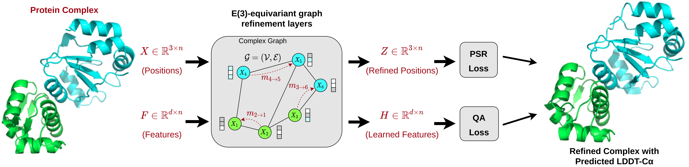
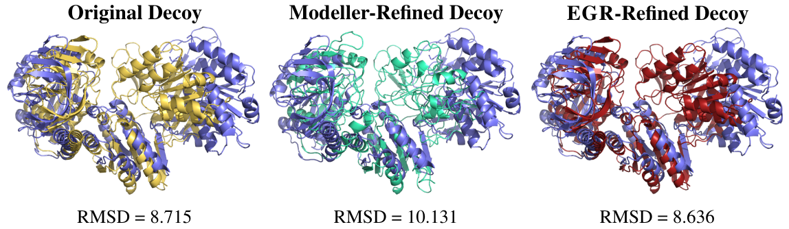

<div align="center">

# DeepRefine

[](https://arxiv.org/abs/2110.02423) [](https://doi.org/10.5281/zenodo.5546775)

[](https://pypi.org/project/DeepRefine/)





</div>

## Description

A geometric deep learning pipeline for refining and assessing protein complex structures,
introducing the new EGR model. [EGR](https://arxiv.org/abs/2110.02423) is an attention-based E(3)-equivariant
graph neural network for end-to-end protein complex structure refinement and quality assessment
of _all-atom_ and C&alpha;-atom protein graphs. EGR achieves significant computational speed-ups
and better or competitive results compared to current baseline methods. If you have any questions
or suggestions, please contact us at <acmwhb@umsystem.edu>. We would be happy to help!

## Citing this work

If you use the code or data associated with this package or find our work helpful, please cite:

```bibtex
@article{morehead2022egr,
  title = {EGR: Equivariant Graph Refinement and Assessment of 3D Protein Complex Structures},
  author = {Alex Morehead and Xiao Chen and Tianqi Wu and Jian Liu and Jianlin Cheng},
  year = {2022},
  eprint = {N/A},
  archivePrefix = {arXiv},
  primaryClass = {cs.LG}
}
```

## Repository Directory Structure

```
DeepRefine
│
└───docker
│
└───img
│
└───project
│     │
│     └───checkpoints
│     │   │
│     │   └───EGR_All_Atom_Models
│     │   │
│     │   └───EGR_Ca_Atom_Models
│     │   │
│     │   └───SEGNN_Ca_Atom_Models
│     │
│     └───datasets
│     │   │
│     │   └───Input
│     │   │
│     │   └───Output
│     │   │
│     │   └───RG
│     │   │
│     │   └───Test_Input
│     │   │
│     │   └───Test_Output
│     │
│     └───modules
│     │   │
│     │   └───egr
│     │   │
│     │   └───segnn
│     │   │
│     │   └───set
│     │   deeprefine_lit_modules.py
│     │
│     └───utils
│     │   │
│     │   └───egr
│     │   │
│     │   └───segnn
│     │   │
│     │   └───set
│     │   deeprefine_constants.py
│     │   deeprefine_utils.py
│     │
│     lit_model_predict.py
│     lit_model_predict_docker.py
│
└───tests
.gitignore
citation.bib
CONTRIBUTING.md
environment.yml
LICENSE
README.md
requirements.txt
setup.cfg
setup.py
```

## Datasets

Our benchmark datasets (PSR Test, Benchmark 2, and M4S Test) can be downloaded as such:
```bash
wget https://zenodo.org/record/6570660/files/DeepRefine_Benchmark_Datasets.tar.xz
```
The refinement datasets contain:
1. `final/raw/pred` directory: contains subdirectories of decoy structure PDB files
2. `final/raw/true` directory: contains subdirectories of native structure PDB files

The quality assessment dataset contains:
1. `target` directories: each contain decoy structure PDB files corresponding to a given protein `target`
2. `label_info.csv`: a CSV listing each decoy structure's DockQ score and CAPRI class label

## Inference Pipeline Directory Structure
An example of the input dataset directory structure our inference pipeline expects,
as well as the output directory structure it will produce, is as follows:
```
DeepRefine
│
└───docker
│
└───img
│
└───project
      │
      └───checkpoints
      │   │
      │   └───EGR_All_Atom_Models
      │   │
      │   └───EGR_Ca_Atom_Models
      │   │
      │   └───SEGNN_Ca_Atom_Models
      │
      └───datasets
          │
          └───Input
          │   │
          │   └───custom_decoy_dataset
          │         │
          │         └───7AMV
          │         │     │
          │         │     └───7AMV_[0-4].pdb  # Input decoy PDB files
          │         │     
          │        ...
          │         │
          │         │
          │         └───7OEL
          │               │
          │               └───7OEL_[0-4].pdb  # Input decoy PDB files
          │
          └───Output
              │
              └───custom_decoy_dataset
                    │
                    └───7AMV
                    │     │
                    │     └───7AMV_[0-4].dill  # Output protein dictionary pickle files containing DGLGraph objects
                    │     │
                    │     └───7AMV_[0-4].pdb  # Input decoy PDB files
                    │     │
                    │     └───7AMV_[0-4]_refined.pdb  # Output refined decoy PDB files
                    │     │
                    │     └───7AMV_[0-4]_refined_plddt.csv  # Output per-residue LDDT scores
                    │     
                   ...
                    │
                    │
                    └───7OEL
                          │
                          └───7OEL_[0-4].dill  # Output protein dictionary pickle files containing DGLGraph objects
                          │
                          └───7OEL_[0-4].pdb  # Input decoy PDB files
                          │
                          └───7OEL_[0-4]_refined.pdb  # Output refined decoy PDB files
                          │
                          └───7OEL_[0-4]_refined_plddt.csv  # Output per-residue LDDT scores
           
```

## Running DeepRefine via Docker

**The simplest way to run DeepRefine is using the provided Docker script.**

The following steps are required in order to ensure Docker is installed and working correctly:

1. Install [Docker](https://www.docker.com/).
    * Install
        [NVIDIA Container Toolkit](https://docs.nvidia.com/datacenter/cloud-native/container-toolkit/install-guide.html)
        for GPU support.
    * Setup running
        [Docker as a non-root user](https://docs.docker.com/engine/install/linux-postinstall/#manage-docker-as-a-non-root-user).

2. Check that DeepRefine will be able to use a GPU by running:

    ```bash
    docker run --rm --gpus all nvidia/cuda:11.3.1-cudnn8-runtime-ubuntu20.04 nvidia-smi
    ```

    The output of this command should show a list of your GPUs. If it doesn't,
    check if you followed all steps correctly when setting up the
    [NVIDIA Container Toolkit](https://docs.nvidia.com/datacenter/cloud-native/container-toolkit/install-guide.html)
    or take a look at the following
    [NVIDIA Docker issue](https://github.com/NVIDIA/nvidia-docker/issues/1447#issuecomment-801479573).

Now that we know Docker is functioning properly, we can begin building our Docker image for DeepRefine:

1. Clone this repository and `cd` into it.

    ```bash
    git clone https://github.com/BioinfoMachineLearning/DeepRefine
    cd DeepRefine/
    DR_DIR=$(pwd)
    ```

2. Build the Docker image (Warning: Requires ~16GB of Space).
    To enable optional support for models operating on Ca atom graphs,
    substitute your license key for Modeller within the following Dockerfile:
    ```bash
    docker build -f docker/Dockerfile -t deeprefine .
    ```

3. Install the `run_docker.py` dependencies. Note: You may optionally wish to
    create a
    [Python Virtual Environment](https://docs.python.org/3/tutorial/venv.html)
    to prevent conflicts with your system's Python environment.

    ```bash
    pip3 install -r docker/requirements.txt
    ```

4. Run `run_docker.py` pointing to an input PDB directory containing all decoy structures
    for a protein target for which you wish to predict refined structures and qualities.
    Importantly, below are configurations for model inference. Select one and copy/paste 
    it into your terminal session. For example, for the RCSB test target with the PDB ID `6GS2`:

    ```bash
    # Settings for predicting refined structures and per-residue quality using all-atom graphs and an EGR model
    # (Note: Best model overall for refinement and QA) #
    ckpt_dir="$DR_DIR"/project/checkpoints/EGR_All_Atom_Models
    ckpt_name=LitPSR_EGR_AllAtomModel1_Seed42.ckpt
    atom_selection_type=all_atom
    seed=42
    nn_type=EGR
    graph_return_format=dgl
    ```
    
    ```bash
    # To predict refined structures and per-residue quality using Ca-atom graphs and an SEGNN model
    # (Note: Best model for balanced QA results) #
    ckpt_dir="$DR_DIR"/project/checkpoints/EGR_Ca_Atom_Models
    ckpt_name=LitPSR_EGR_CaAtomModel1_Seed32.ckpt
    atom_selection_type=ca_atom
    seed=32
    nn_type=EGR
    graph_return_format=dgl
    ```
    
    ```bash
    # To predict refined structures and per-residue quality using Ca-atom graphs and an SEGNN model
    # (Note: Best model for QA ranking loss) #
    ckpt_dir="$DR_DIR"/project/checkpoints/SEGNN_Ca_Atom_Models
    ckpt_name=LitPSR_SEGNN_CaAtomModel_Seed42.ckpt
    atom_selection_type=ca_atom
    seed=42
    nn_type=SEGNN
    graph_return_format=pyg
    ```
    
    Refine atom positions and predict per-residue LDDT scores:
    ```bash
    python3 docker/run_docker.py --perform_pos_refinement --num_gpus 1 --num_workers 1 --input_dataset_dir "$DR_DIR"/project/datasets/Test_Input/Test_Target/ --output_dir "$DR_DIR"/project/datasets/Test_Output/Test_Target/ --ckpt_dir "$ckpt_dir" --ckpt_name "$ckpt_name" --atom_selection_type "$atom_selection_type" --seed "$seed" --nn_type "$nn_type" --graph_return_format "$graph_return_format"
    ```
   
    Or, solely predict per-residue LDDT scores (for faster inference times with Ca atom models):
    ```bash
    python3 docker/run_docker.py --num_gpus 1 --num_workers 1 --input_dataset_dir "$DR_DIR"/project/datasets/Test_Input/Test_Target/ --output_dir "$DR_DIR"/project/datasets/Test_Output/Test_Target/ --ckpt_dir "$ckpt_dir" --ckpt_name "$ckpt_name" --atom_selection_type "$atom_selection_type" --seed "$seed" --nn_type "$nn_type" --graph_return_format "$graph_return_format"
    ```
   
    This script will generate and (as PDB files - e.g., `datasets/Test_Output/Test_Target/6GS2/6GS2_refined.pdb`)
    save to the given output directory refined PDB structures as well as the chosen equivariant
    graph neural network's predictions of per-residue structural quality.

5. Note that by using the default

    ```bash
    --num_gpus 0
    ```

    flag when executing `run_docker.py`, the Docker container will only 
    make use of the system's available CPU(s) for prediction. However,
    by specifying

    ```bash
    --num_gpus 1
    ```
   
    when executing `run_docker.py`, the Docker container will then
    employ the first available GPU for prediction.

6. Also, note that *protein dictionary files (e.g., `6GS2.dill`) created outside of the
    Docker inference pipeline are not compatible with the Docker inference pipeline
    and must be re-processed from scratch*.

## Running DeepRefine via a Traditional Installation (for Linux-Based Operating Systems)

First, install and configure Conda environment:

```bash
# Clone this repository:
git clone https://github.com/BioinfoMachineLearning/DeepRefine

# Change to project directory:
cd DeepRefine
DR_DIR=$(pwd)

# Set up Conda environment locally
conda env create --name DeepRefine -f environment.yml

# Activate Conda environment located in the current directory:
conda activate DeepRefine

# Explicitly install DGL 0.8.0post1 (CUDA 11.3) with Conda
conda install -c dglteam https://anaconda.org/dglteam/dgl-cuda11.3/0.8.0post1/download/linux-64/dgl-cuda11.3-0.8.0post1-py38_0.tar.bz2

# Explicitly install latest version of BioPython with pip
pip3 install git+https://github.com/biopython/biopython@1dd950aec08ed3b63d454fea662697f6949f8dfa

# (Optional) To enable support for models operating on Ca atom graphs, substitute XXXX with your license key for Modeller:
sed -i '2s/.*/license = r\x27'XXXX'\x27/' ~/anaconda3/envs/DeepRefine/lib/modeller-10.2/modlib/modeller/config.py

# (Optional) Perform a full install of the pip dependencies described in 'requirements.txt':
pip3 install -e .

# (Optional) To remove the long Conda environment prefix in your shell prompt, modify the env_prompt setting in your .condarc file with:
conda config --set env_prompt '({name})'
 ```

## Inference

### Predict refined structures and their per-residue quality

Navigate to the project directory and run the prediction script
with the filename of the input PDB, containing all chains.

 ```bash
# Navigate to project directory 
cd "$DR_DIR"/project
```

Configurations for model inference (Select one and copy/paste it into your terminal session):

```bash
# Settings for predicting refined structures and per-residue quality using all-atom graphs and an EGR model
# (Note: Best model overall for refinement and QA) #
ckpt_dir="$DR_DIR"/project/checkpoints/EGR_All_Atom_Models
ckpt_name=LitPSR_EGR_AllAtomModel1_Seed42.ckpt
atom_selection_type=all_atom
seed=42
nn_type=EGR
graph_return_format=dgl
```

```bash
# To predict refined structures and per-residue quality using Ca-atom graphs and an SEGNN model
# (Note: Best model for balanced QA results) #
ckpt_dir="$DR_DIR"/project/checkpoints/EGR_Ca_Atom_Models
ckpt_name=LitPSR_EGR_CaAtomModel1_Seed32.ckpt
atom_selection_type=ca_atom
seed=32
nn_type=EGR
graph_return_format=dgl
```

```bash
# To predict refined structures and per-residue quality using Ca-atom graphs and an SEGNN model
# (Note: Best model for QA ranking loss) #
ckpt_dir="$DR_DIR"/project/checkpoints/SEGNN_Ca_Atom_Models
ckpt_name=LitPSR_SEGNN_CaAtomModel_Seed42.ckpt
atom_selection_type=ca_atom
seed=42
nn_type=SEGNN
graph_return_format=pyg
```

Decide whether to predict per-residue LDDT scores *and refine atom positions* or to instead solely predict per-residue LDDT scores (for faster inference times with Ca atom models):
```bash
perform_pos_refinement=True
```

Make predictions:
```bash
# Hint: Run `python3 lit_model_predict.py --help` to see all available CLI arguments
python3 lit_model_predict.py --perform_pos_refinement "$perform_pos_refinement" --device_type gpu --num_devices 1 --num_compute_nodes 1 --num_workers 1 --batch_size 1 --input_dataset_dir "$DR_DIR"/project/datasets/Test_Input/Test_Target/ --output_dir "$DR_DIR"/project/datasets/Test_Output/Test_Target/ --ckpt_dir "$ckpt_dir" --ckpt_name "$ckpt_name" --atom_selection_type "$atom_selection_type" --seed "$seed" --nn_type "$nn_type" --graph_return_format "$graph_return_format"
```

This script will generate and (as PDB files - e.g., `datasets/Test_Output/Test_Target/6GS2/6GS2_refined.pdb`)
save to the given output directory refined PDB structures as well as the chosen equivariant
graph neural network's predictions of per-residue structural quality.

Also, note that *protein dictionary files (e.g., `6GS2.dill`) created outside of the 
traditional inference pipeline are not compatible with the traditional inference pipeline 
and must be re-processed from scratch*.

## Main Results
The following three tables show EGR's consistent **best** or **competitive** results
on all test datasets in terms of *DockQ refinement metrics*, *QA ranking performance*, 
and *QA ranking loss*. The best results are highlighted in **bold**.

### Refinement Results
Table 1: Performance of different refinement methods on each test dataset.

| &Delta;Metric         | DockQ &uparrow;             | iRMSD &downarrow;          | LRMSD &downarrow;             | FI-DockQ &uparrow;         | API-DockQ &uparrow;  |
|-----------------------|-----------------------------|----------------------------|-------------------------------|----------------------------|----------------------|
|                       |                             |                            | <u>PSR-Dockground (4,799)</u> |                            |                      |
| Modeller              | +0.0002                     | -0.6331                    | -1.0027                       | 63.03%                     | 0.32%                |
| EGR-C&alpha;-Modeller | +0.0053 &pm; 0.0011         | -1.2285 &pm; 0.0330        | -3.5226 &pm; 0.3125           | 79.30% &pm; 0.93%          | 0.89% &pm; 0.15%     |
| SET-AllAtom           | +0.0132 &pm; 0.0040         | -0.8808 &pm; 0.1158        | -1.6478 &pm; 0.1047           | 84.90% &pm; 1.13%          | 1.69 &pm; 0.35%      |
| SEGNN-AllAtom         | +**0.0144** &pm; **0.0024** | -**2.4562** &pm; **0.049** | -**6.6603** &pm; **0.6702**   | **94.46**% &pm; **0.60**%  | 1.89% &pm; 0.29%     |
| <u>EGR-AllAtom</u>    | +0.0097 &pm; 0.0002         | -0.6274 &pm; 0.0669        | -2.5561 &pm; 0.1584           | 83.66% &pm; 0.49%          | 1.59% &pm; 0.11%     |
|                       |                             |                            | <u>PSR-DeepHomo (376)</u>     |                            |                      |
| Modeller              | -0.2465                     | +1.5912                    | +5.3457                       | 8.24%                      | 0.53%                |
| EGR-C&alpha;-Modeller | -0.2796 &pm; 0.0055         | +2.2075 &pm; 0.0839        | +6.1711 &pm; 0.1842           | 8.16% &pm; 0.76%           | 1.17% &pm; 0.18%     |
| SET-AllAtom           | -0.0034 &pm; 0.0003         | +0.0275 &pm; 0.0050        | +0.0273 &pm; 0.0104           | 27.39% &pm; 4.36%          | 0.20% &pm; 0.08%     |
| SEGNN-AllAtom         | -0.0468 &pm; 0.0091         | +0.2950 &pm; 0.0741        | +0.3593 &pm; 0.1722           | 16.31% &pm; 3.54%          | 0.87% &pm; 0.20%     |
| <u>EGR-AllAtom</u>    | -**0.0006** &pm; **0.0018** | +**0.0121** &pm; **0.0054** | +**0.0013** &pm; **0.0028**   | **45.12**% &pm; **6.99**%  | 0.41% &pm; 0.03%     |
|                       |                             |                            | <u>PSR-EVCoupling (195)</u>   |                            |                      |
| Modeller              | -0.1738                     | +1.1467                    | +4.9877                       | 7.18%                      | 0.74%                |
| EGR-C&alpha;-Modeller | -0.2150 &pm; 0.0073         | +1.9651 &pm; 0.0647        | +5.8477 &pm; 0.7759           | 9.91% &pm; 1.74%           | 1.49% &pm; 0.37%     |
| SET-AllAtom           | -0.0016 &pm; 0.0002         | +**0.0149** &pm; **0.0007** | +0.0108 &pm; 0.0040           | 27.86% &pm; 5.24%          | 0.31% &pm; 0.11%     |
| SEGNN-AllAtom         | -0.0250 &pm; 0.0069         | +0.1646 &pm; 0.0633        | +0.2400 &pm; 0.1044           | 18.29% &pm; 3.41%          | 0.89% &pm; 0.18%     |
| <u>EGR-AllAtom</u>    | +**0.0010** &pm; **0.0010** | +0.0026 &pm; 0.0031        | -**0.0059** &pm; **0.0017**   | **43.93**% &pm; **5.00**%  | 0.48% &pm; 0.03%     |
|                       |                             |                            | <u>Benchmark 2 (17)</u>       |                            |                      |
| Modeller              | -0.1855                     | +0.7939                    | +3.0277                       | 5.88%                      | 0.60%                |
| GalaxyRefineComplex   | -0.0074                     | +0.0778                    | -**0.0246**                   | 22.22%                     | 2.12%                |
| GNNRefine             | +0.0025                     | +0.0226                    | +0.0602                       | 47.06%                     | 1.26%                |
| EGR-C&alpha;-Modeller | -0.2644 &pm; 0.0437         | +2.118 &pm; 0.7832         | +5.9196 &pm; 1.8589           | 15.69% &pm; 2.77%          | 1.28% &pm; 0.84%     |
| SET-AllAtom           | -0.0078 &pm; 0.0015         | +0.0729 &pm; 0.0186        | +0.0469 &pm; 0.0114           | 29.63% &pm; 2.62%          | 0.33% &pm; 0.14%     |
| SEGNN-AllAtom         | -0.0328 &pm; 0.0062         | +0.0807 &pm; 0.0790        | +0.0781 &pm; 0.1371           | 31.37% &pm; 5.54%          | 1.24% &pm; 0.59% |
| <u>EGR-AllAtom</u>    | -**0.0010** &pm; **0.0028** | -**0.0002** &pm; **0.003** | -0.0121 &pm; 0.0021           | **43.14**% &pm; **10.00**% | 0.59% &pm; 0.08% |

### Structure Quality Assessment (QA) Results
Table 2: Hit rate performance of different QA methods on the M4S test dataset.

| ID      | EGR-C&alpha;-Modeller | SET-AllAtom | SEGNN-AllAtom | <u>EGR-AllAtom</u> | GNN_DOVE | **Top-10 Best** |
|---------|--------------|------------|--------|------------|----------|-----------------|
| 7AOH    | 10/10/6      | 9/8/6      | 9/9/9  | 9/9/9      | 9/9/0    | 10/10/10        |
| 7D7F    | 0/0/0        | 2/0/0      | 0/0/0  | 0/0/0      | 0/0/0    | 5/0/0           |
| 7AMV    | 10/10/8      | 10/10/5    | 10/10/9 | 10/10/5    | 10/10/6  | 10/10/10        |
| 7OEL    | 10/10/0      | 10/10/0    | 10/9/0 | 10/9/0     | 10/10/0  | 10/10/0         |
| 7O28    | 10/10/0      | 10/10/0    | 10/10/0 | 10/10/0    | 10/10/0  | 10/10/0         |
| 7MRW    | 6/5/0        | 0/0/0      | 0/0/0  | 0/0/0      | 0/0/0    | 10/10/0         |
| 7D3Y    | 0/0/0        | 0/0/0      | 0/0/0  | 1/0/0      | 0/0/0    | 10/0/0          |
| 7NKZ    | 10/10/9      | 10/9/9     | 10/10/3 | 10/9/9     | 10/9/9   | 10/10/10        |
| 7LXT    | 10/10/0      | 4/3/0      | 6/5/0  | 8/7/0      | 1/0/0    | 10/10/0         |
| 7KBR    | 10/10/10     | 10/10/10   | 10/10/10 | 10/10/9    | 10/10/9  | 10/10/10        |
| 7O27    | 10/5/0       | 10/7/0     | 10/6/0 | 10/4/0     | 10/4/0   | 10/10/0         |
| Summary | **9**/**9**/**4** | **9**/8/**4** | 8/8/**4** | **9**/8/**4** | 8/7/3    | 11/9/4          |

Table 3: Ranking loss of different QA methods on the M4S test dataset.

| ID      | EGR-C&alpha;-Modeller      | SET-AllAtom    | SEGNN-AllAtom   | <u>EGR-AllAtom</u>         | GNN_DOVE       |
|---------|----------------------------|----------------|-----------------|----------------------------|----------------|
| 7AOH    | 0.0610                     | 0.9280         | 0.9280          | 0.0350                     | 0.9280         |
| 7D7F    | 0.4700                     | 0.4700         | 0.4710          | 0.4590                     | 0.0030         |
| 7AMV    | 0.1730                     | 0.3420         | 0.0130          | 0.3420                     | 0.3420         |
| 7OEL    | 0.2100                     | 0.2100         | 0.3790          | 0.2100                     | 0.2100         |
| 7O28    | 0.2330                     | 0.0240         | 0.2740          | 0.2440                     | 0.2440         |
| 7MRW    | 0.6000                     | 0.5550         | 0.6030          | 0.5550                     | 0.5980         |
| 7D3Y    | 0.3240                     | 0.2950         | 0.1740          | 0.2950                     | 0.2950         |
| 7NKZ    | 0.0220                     | 0.1100         | 0.1830          | 0.4590                     | 0.4590         |
| 7LXT    | 0.0500                     | 0.2950         | 0.2950          | 0.3890                     | 0.2950         |
| 7KBR    | 0.1700                     | 0.1520         | 0.0520          | 0.1520                     | 0.0680         |
| 7O27    | 0.3340                     | 0.3340         | 0.3650          | 0.3180                     | 0.3340         |
| Summary | **0.2406** &pm; **0.1801** | 0.3377 &pm; 0.2486 | 0.3397 &pm; 0.2613 | **0.3144** &pm; **0.1506** | 0.3432 &pm; 0.2538 |

## Train EGR models using Custom Datasets
We plan to release our training code and datasets soon.

## Acknowledgements

DeepRefine communicates with and/or references the following separate libraries
and packages:

* [Abseil](https://github.com/abseil/abseil-py)
* [Biopython](https://biopython.org)
* [Docker](https://www.docker.com)
* [NumPy](https://numpy.org)
* [pytorch](https://github.com/pytorch/pytorch)
* [pytorch-lightning](https://github.com/PyTorchLightning/pytorch-lightning)
* [SciPy](https://scipy.org)
* [tqdm](https://github.com/tqdm/tqdm)

We thank all their contributors and maintainers!

## License and Disclaimer

Copyright 2022 University of Missouri-Columbia Bioinformatics & Machine Learning (BML) Lab.

### DeepRefine Code License

Licensed under the GNU Public License, Version 3.0 (the "License"); you may not use
this file except in compliance with the License. You may obtain a copy of the
License at https://www.gnu.org/licenses/gpl-3.0.en.html.

### Third-party software

Use of the third-party software, libraries or code referred to in the
[Acknowledgements](#acknowledgements) section above may be governed by separate
terms and conditions or license provisions. Your use of the third-party
software, libraries or code is subject to any such terms and you should check
that you can comply with any applicable restrictions or terms and conditions
before use.
